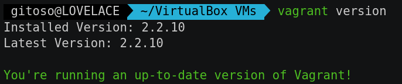
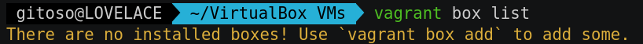
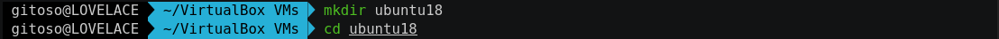
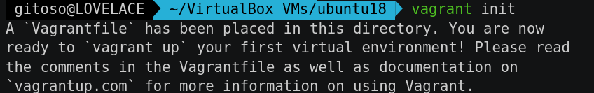
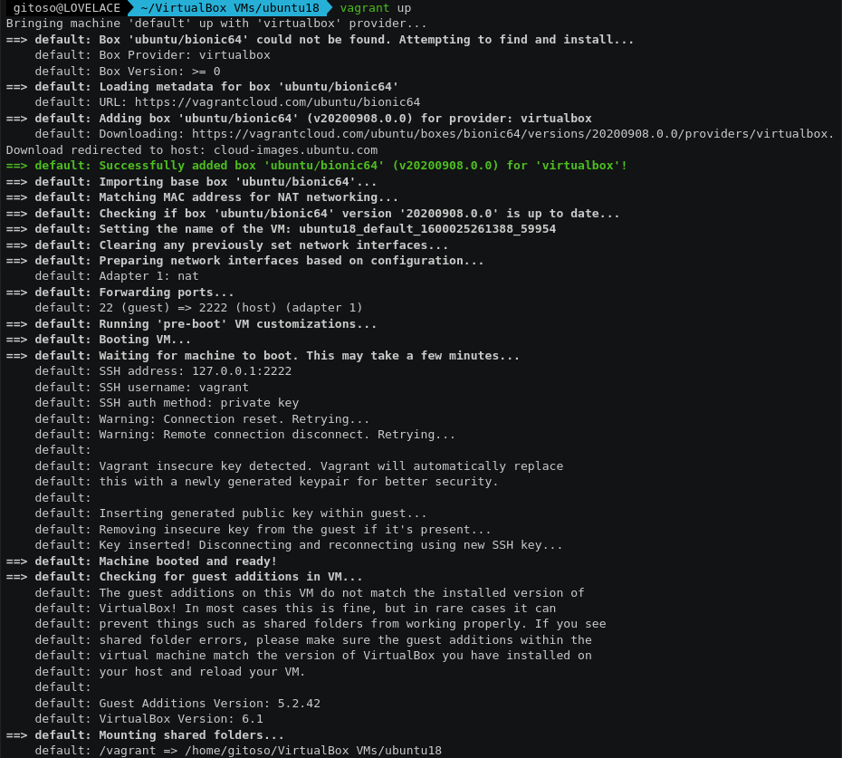
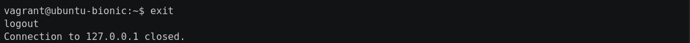
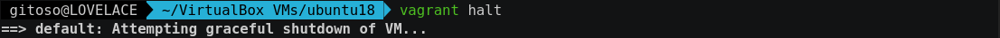
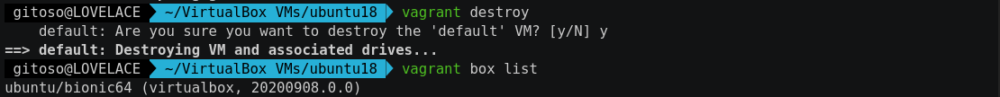

# (CSC-05) Lab 2 - Parte A: Virtualbox & Vagrant

Neste relatório serão descritos os passos realizados ao seguir o roteiro disponível para o _Laboratório 2 - Parte A: Virtualbox e Vagrant_.

A execução do laboratório foi gravada no formato _asciinema_ (gravação do terminal, sem intervalo entre comandos). Para cada subseção à seguir, serão disponibilizados os links referentes as gravações.


**Tabela de Conteúdos**:
<!-- vscode-markdown-toc -->
* 1. [Parte I: Introdução](#ParteI:Introduo)
		* 1.1. [Gravação:](#Gravao:)
		* 1.2. [Ambiente](#Ambiente)
		* 1.3. [Execução passo-a-passo:](#Execuopasso-a-passo:)
* 2. [Parte II: VM Windows](#ParteII:VMWindows)
* 3. [Parte III: "Mini-Cluster"](#ParteIII:Mini-Cluster)

<!-- vscode-markdown-toc-config
	numbering=true
	autoSave=true
	/vscode-markdown-toc-config -->
<!-- /vscode-markdown-toc -->

---


##  1. <a name='ParteI:Introduo'></a>Parte I: Introdução

####  1.1. <a name='Gravao:'></a>Gravação:
- Asciinema: [https://asciinema.org/a/359506](https://asciinema.org/a/359506)

####  1.2. <a name='Ambiente'></a>Ambiente

O Laboratório foi executado no seguinte ambiente:
- **Sistema Operacional**: Arch Linux (x64)
    - **Kernel**: 5.8.8-arch1-1
- **CPU**: Intel i7-6500U
- **RAM**: 8 GB
- **GPU**: Intel Skylake GT2 [HD Graphics 520]


####  1.3. <a name='Execuopasso-a-passo:'></a>Execução passo-a-passo:
A seguir, a execução dos passos do laboratório será seguida por _screenshots_ mostrando o resultado obtido para cada passo.

###### 3) Verificar qual a versão do vagrant está instalada (no powershell ou cmder)

```
## vagrant version
```
---
No caso executei o Laboratório em um ambiente Linux (Arch Linux x64) e portanto utilizei uma linha de comando para o ambiente Linux.



###### 4) Verificar as “boxes” instaladas
```
## vagrant box list
```
---



###### 5) Criar um diretório com o nome “ubuntu18” e entrar nesse diretório
```
## cd Documentos
## mkdir ubuntu18
## cd ubuntu18
```
---



###### 6) Criar um arquivo de inicialização do Vagrantfile
```
## vagrant init
```
---


###### 7) Abrir em um editor de texto o arquivo Vagrantfile criado, entender
---
Segue abaixo uma imagem do conteúdo original do arquivo `Vagrantfile` estudado (aberto no editor `vim`)


###### 8) Procurar por uma imagem útil para uso no VagrantCloud:
---

Link para o VagrantCloud: [https://app.vagrantup.com/boxes/search](https://app.vagrantup.com/boxes/search)


###### 9) Usando editor de texto, modificar o “box” para ubuntu/bionic64
---


###### 10) Após finalizar a edição, execute o comando, dentro da pasta ubuntu18
```
## vagrant up
```
---


###### 11) Entre no virtualbox e verifique que sua maquina virtual esta rodando.
---


###### 12) Vamos logar na maquina agora via SSH
```
## vagrant ssh
```
---


###### 13) Dentro da máquina virtual verifique diversas características da VM
```
## free -h
## df -h
## sudo fdisk -l
```
---


###### 14) Dentro da maquina virtual atualize o sistema e instale o htop
```
## sudo apt update
## sudo apt upgrade
## sudo apt install htop
```
---


Executando o `htop` só para verificar:


###### 15) Saia da maquina guest VM de volta para o host
```
## exit
```
---



###### 16) Verifique o estado da VM perante o vagrant
```
## vagrant status
```
---


###### 17) Verificar as boxes instaladas
```
## vagrant box list
```
---


###### 18) Desligue a maquina virtual de maneira "suave"
```
## vagrant halt
```
---



Verificando o estado da VM no VirtualBox:


###### 19) Destrua / Limpe a VM e a box dentro dela, liberando espaço e recursos
```
## vagrant destroy
## vagrant box list
```
---



##  2. <a name='ParteII:VMWindows'></a>Parte II: VM Windows

**Gravação**:
- Asciinema: [...](...)

A seguir, a execução dos passos do laboratório será seguida por _screenshots_ mostrando o resultado obtido para cada passo.

###### 20) Crie um diretório “windows2010” em Documentos

###### 21) Crie um arquivo Vagrantfile do zero contendo o código fornecido

###### 22) Crie um segundo arquivo de texto com o nome “rdp.ps1” e coloque no mesmo diretório

###### 23) Verifique o virtualbox novamente, veja a VM Windows rodando

###### 24) Acionar o browser e instalar o "chocolatey"

###### 25) Instale o browser "Firefox"

###### 26) Reconfigurar a memoria para 1G RAM, alterando o arquivo Vagrantfile e testar recarregando essa configuração

###### 27) Destruir a VM

##  3. <a name='ParteIII:Mini-Cluster'></a>Parte III: "Mini-Cluster"

**Gravação**:
- Vídeo: [...](...)
- Asciinema: [...](...)

A seguir, a execução dos passos do laboratório será seguida por _screenshots_ mostrando o resultado obtido para cada passo.

###### 28) Criar um novo diretório "doisubuntu"

###### 29) Criar uma arquivo Vagrantfile novo contendo 2 maquinas virtuais

###### 30) Acionar os ambientes no vagrant

###### 31) Verificar o status e acessar cada uma das maquinas de maneira independente, e atualizar a maquina vm01, fazer teste de ping entre as maquinas

###### 32) Atualizar o Vagrantfile e trocar o box da vm02 por bionic64. E Instalar apache2 na vm02

###### 33) Testar acessar o servidor web com o browser a partir do Host e a partir do vm01 guest usando “wget” no Red Hat

###### 34) Explorando um pouco dos "plug-ins" do Vagrant
