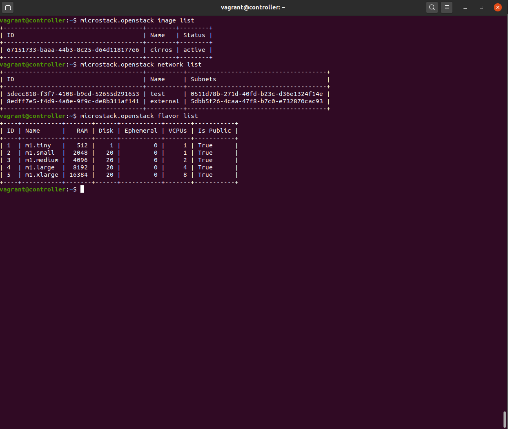
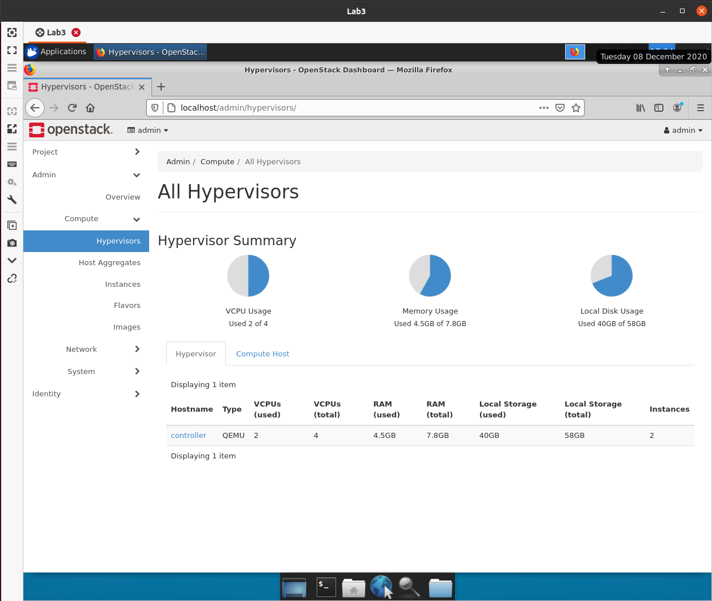
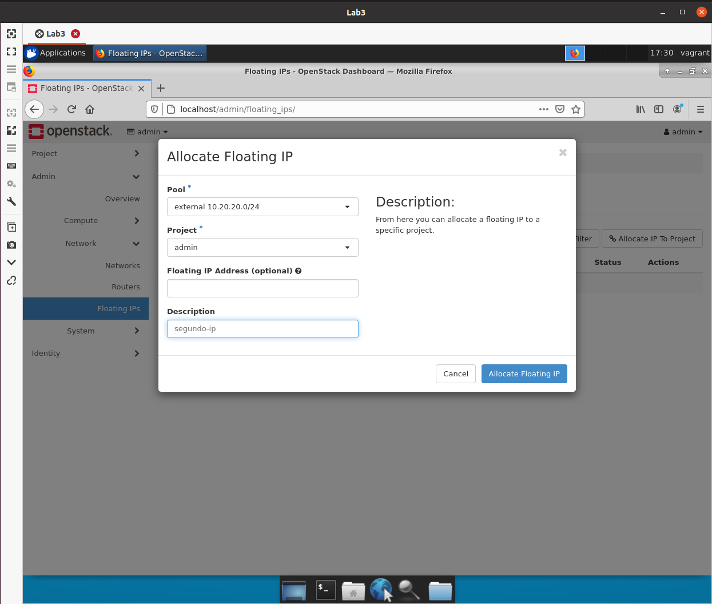

# Lab 3: Nuvem Privada OpenStack

- **Disciplina:** CSC-05: Operações Cibernéticas e Jogos de Guerra Cibernética - Lado Defesa
- **Aluno:** Gianluigi Dal Toso
- **Turma:** 2021
- **Data:** 19/10/2020

Este relatório também pode ser conferido online (em formato Markdown) pela URL: [https://gitlab.com/gitoso/csc-05/-/tree/master/Lab%203](https://gitlab.com/gitoso/csc-05/-/tree/master/Lab%203)

---

Neste relatório serão descritos os passos realizados ao seguir o roteiro disponível para o _Laboratório 3: Nuvem Privada OpenStack_.

<!-- A execução do laboratório foi gravada no formato _asciinema_ (gravação do terminal, sem intervalo entre comandos). Para cada subseção à seguir, serão disponibilizados os links referentes as gravações. -->

O Laboratório foi executado no seguinte ambiente:
- **Sistema Operacional**: Arch Linux x64 (5.9.11-arch2-1)
- **CPU**: Intel i7-6500U
- **RAM**: 8 GB
- **GPU**: Intel Skylake GT2 [HD Graphics 520]


**Tabela de Conteúdos**:

<!-- vscode-markdown-toc -->
* [Parte 1: Preparação de ambiente](#Parte1:Preparaodeambiente)
* [Parte 2: Comandos de "OpenStack"](#Parte2:ComandosdeOpenStack)

<!-- vscode-markdown-toc-config
	numbering=false
	autoSave=true
	/vscode-markdown-toc-config -->
<!-- /vscode-markdown-toc -->

---

## <a name='Parte1:Preparaodeambiente'></a>Parte 1: Preparação de ambiente


### <a name='PrepararumaVMUbuntu18.04paraosexperimentos'></a>1) Preparar uma VM Ubuntu 18.04 para os experimentos

Usar a seguinte configuração do Vagrant:
```conf
Vagrant.configure("2") do |config|
    config.vm.box = "ubuntu/bionic64"
    config.vm.hostname = "controller"
    config.disksize.size = '50GB'
    config.vm.provider "virtualbox" do |vb|
        vb.memory = 8192
        vb.cpus = 4
        vb.customize ["modifyvm", :id, "--nested-hw-virt", "on"]
    end
    config.vm.network :private_network, ip: "172.16.2.25"
end
```

E usar os comandos
```bash
vagrant up
vagrant ssh
lscpu | grep Virtualization
```

---
**Screenshots**:


### <a name='Instalarosnapdeomicrostack'></a>2) Instalar o snapd e o microstack
```
sudo apt update
sudo apt install snapd -y
sudo snap install microstack --channel=rocky/edge --classic
```

(Na verdade acabei realizando uma mudança e resolvi trabalhar em um Ubuntu local)

---
**Screenshots**:


### <a name='Prepararaconfiguraodomicrostack'></a>3) Preparar a configuração do microstack
```
sudo microstack.init
```

---
**Screenshots**:


### <a name='Acesseviabrowseromicrostackcompletologin:adminsenha:keystone'></a>4) Acesse via browser o microstack completo (login: admin / senha: keystone)

---
**Screenshots**:


### <a name='ProcurenessapginadegerenciamentodoOpenStackquantosvCPUsestodisponveisquantodememriadisponvelparaVMsequantodediscodisponvelparaVMs.AdminComputeHypervisors'></a>5) Procure nessa página de gerenciamento do OpenStack quantos vCPUs estão disponíveis, quanto de memória disponível para VMs, e quanto de disco disponível para VMs. (Admin » Compute » Hypervisors)

---
**Screenshots**:


### <a name='Verifiquequeoprojetoadmin:possuiumaimagemprontaparaserusadaimagemcirroscomtamanhode12.3MB'></a>6) Verifique que o projeto "admin: possui uma "imagem" pronta para ser usada (imagem "cirros") com tamanho de 12.3MB

---
**Screenshots**:


### <a name='Verifiqueaconfiguraodarede'></a>7) Verifique a configuração da rede

```
rede interna (entre VMs)
rede externa (onde um roteador permite o acesso)
```

---
**Screenshots**:


### <a name='Verifiquequefoiconfiguradoumroteadorvirtual'></a>8) Verifique que foi configurado um roteador virtual

---
**Screenshots**:


### <a name='FazertestedepingdaVMUbuntuparaainterfaceexternadoroteador'></a>9) Fazer teste de ping da VM Ubuntu para a interface externa do roteador

```
ping 10.20.20.203
```

---
**Screenshots**:


---
## <a name='Parte2:ComandosdeOpenStack'></a>Parte 2: Comandos de "OpenStack"

### <a name='Visualizarasimagensflavorsredescadastradas'></a>1) Visualizar as imagens, flavors, redes cadastradas
```
microstack.openstack image list
microstack.openstack network list
microstack.openstack flavor list
```

---
**Screenshots**:



### <a name='Comandosparacriarumamquinavirtualcirros'></a>2) Comandos para criar uma máquina virtual "cirros"
```
microstack.openstack server create --flavor m1.small --nic net-id=test --image cirros meu-servidor
```

---
**Screenshots**:


### <a name='ConfigurareatribuirumendereoexternoparaaVM'></a>3) Configurar e atribuir um endereço "externo" para a VM

```
microstack.openstack floating ip create -f value -c floating_ip_address external
microstack.openstack server add floating ip meu-servidor <valor do comando anterior>
```

---
**Screenshots**:


### <a name='AcessandoamquinavirtualcirrosqueestfuncionandoviaSSH.Lembrarqueoacessoaumaimagemcirrosnorequerchavecriptogrficaefeitoporsenhasimpleslogin:cirrossenha:gocubsgo'></a>4) Acessando a máquina virtual cirros que está funcionando via SSH. Lembrar que o acesso a uma imagem cirros não requer chave criptográfica e é feito por senha simples (login: cirros, senha: gocubsgo)

---
**Screenshots**:


### <a name='VerifiqueaplacaderededaVMqueestaconectadanaredeinternamasqueconsegueseguirparaainternet'></a>5) Verifique a placa de rede da VM que esta conectada na rede interna, mas que consegue seguir para a internet

---
**Screenshots**:


### <a name='CriemaisumVMetenteverificarseexisteconectividadeentreasVMs'></a>6) Crie mais um VM e tente verificar se existe conectividade entre as VMs
# microstack.openstack server create --flavor m1.small --nic net-id=test -- image cirros meu-servidor2
(veja o consumo de recursos no cluster OpenStack)

---
**Screenshots**:


### <a name='NamaquinavirtualcirrosquevoctinhaacessoviaSSHtenterealizaropingeosshparaaoutramquina.'></a>7) Na maquina virtual cirros que você tinha acesso via SSH, tente realizar o ping e o ssh para a outra máquina.

---
**Screenshots**:


### <a name='Criarumaimagemubuntu18.04paraoOpenStack'></a>8) Criar uma imagem “ubuntu18.04” para o OpenStack

```
# wget https://cloud-images.ubuntu.com/minimal/releases/bionic/release-20180705/ubuntu-18.04-minimal-cloudimg-amd64.img

# microstack.openstack image create --public --disk-format qcow2 --container-format bare --file ubuntu-18.04-minimal-cloudimg-amd64.img ubuntu-18.04
```

---
**Screenshots**:


### <a name='Crieumainstanciausandoessaimagemubuntu18.04econfigureparaaceitarumachavecriptogrficaedepoisalocarumendereoIPflutuanteparaessaVM.Configurarachavecriptogrficachamardeteste:'></a>9) Crie uma instancia usando essa imagem ubuntu 18.04 e configure para aceitar uma chave criptográfica e depois alocar um endereço IP “flutuante” para essa VM. Configurar a chave criptográfica (chamar de teste):

```
# nano teste (copiar do clipboard do browser para o arquivo na VM OpenStack)
# chmod 400 teste
# ssh -i ./teste ubuntu@10.20.20.100 (onde 10.20.20.100 foi IP alocado)
```

---
**Screenshots**:



### <a name='Fazersshnainstancia'></a>10) Fazer ssh na instancia

---
**Screenshots**:
