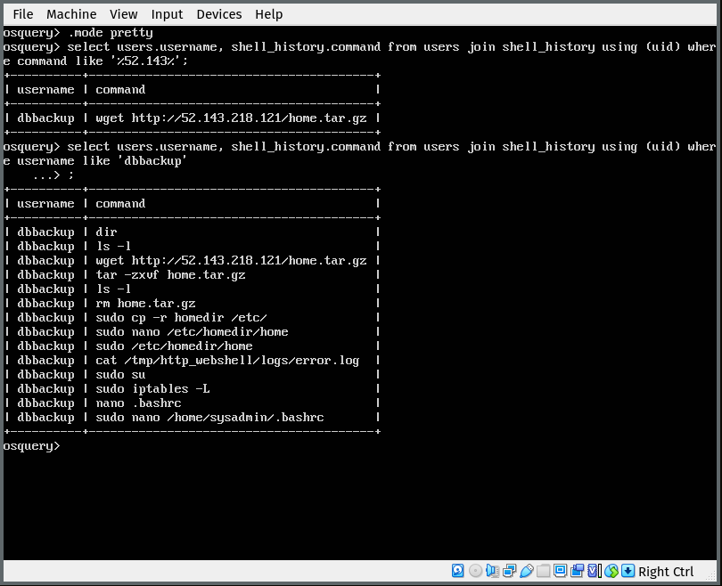
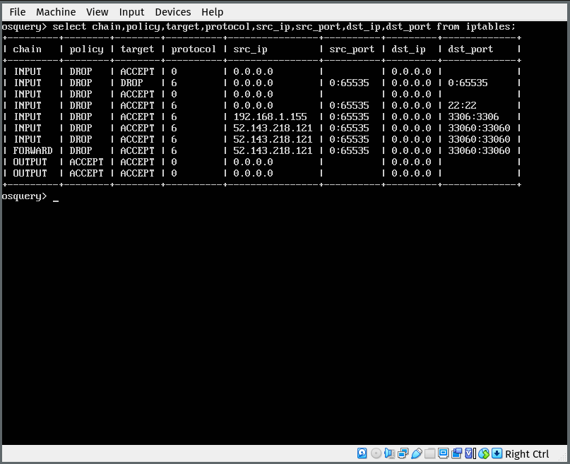

# Lab 5: Threat Intelligence (OSquery 01)

- **Disciplina:** CSC-05: Operações Cibernéticas e Jogos de Guerra Cibernética - Lado Defesa
- **Aluno:** Gianluigi Dal Toso
- **Turma:** 2021
- **Data:** 19/11/2020

Este relatório também pode ser conferido online (em formato Markdown) pela URL: [CSC-05: Lab 5-1](https://gitlab.com/gitoso/csc-05/-/tree/master/Lab%205-1)

---

Neste relatório serão descritos os passos realizados ao seguir o roteiro disponível para o _Laboratório 5: Threat Intelligence (OSquery 01)_.

<!-- A execução do laboratório foi gravada no formato _asciinema_ (gravação do terminal, sem intervalo entre comandos). Para cada subseção à seguir, serão disponibilizados os links referentes as gravações. -->

O Laboratório foi executado no seguinte ambiente:
- **Sistema Operacional**: Arch Linux x64 (5.9.8-arch1-1)
- **CPU**: Intel i7-6500U
- **RAM**: 8 GB
- **GPU**: Intel Skylake GT2 [HD Graphics 520]


Para cada sessão do relatórios, será inserida uma captura de tela referente indicando a execução do laboratório.

## <a name='TabeladeContedos'></a>Tabela de Conteúdos


<!-- vscode-markdown-toc -->
* [Pré-Lab](#Pr-Lab)
* [Parte 1 - Introdução](#Parte1-Introduo)
* [Parte 2 - Acesso ao Sistema](#Parte2-AcessoaoSistema)
* [Parte 3 - Investigando](#Parte3-Investigando)

<!-- vscode-markdown-toc-config
	numbering=false
	autoSave=true
	/vscode-markdown-toc-config -->
<!-- /vscode-markdown-toc -->

---


## <a name='Pr-Lab'></a>Pré-Lab

1) Baixar o laboratório OSquery disponibilzado no Classroom.
2) Realizar a criação da máquina virtual do laboratório no Virtualbox.

## <a name='Parte1-Introduo'></a>Parte 1 - Introdução

Cenário: Voce estava de folga no final de semana, e segunda-feira está revisando os alertas do IDS de rede que aconteceram no final de semana. Um alerta se destaca, um tráfego FTP (transferência de arquivos) de saída de um servidor de banco de dados, especificamente sexta, sábado e domingo à noite.

O alerta foi gerado porque essa não é uma atividade normal desse servidor de banco de dados Linux. Este servidor é baseado no Ubuntu Linux (DB-PROD) e executa o MySQL para hospedar o banco de dados do aplicativo de pagamento voltado para o cliente da sua empresa.

## <a name='Parte2-AcessoaoSistema'></a>Parte 2 - Acesso ao Sistema

Inicie a máquina. Conserte a interface de rede e coloque uma interface NAT para a mesma. Para acessar a máquinas após o boot, as credenciais de login são:
```
user: sysadmin
password: 12Monkeys
```

Após o login, você pode iniciar o osqueryi digitando o seguinte no prompt de comando: “sudo osqueryi”. Lembrando que a credencial de sudoer é a mesma de cima.

---
**Screenshot**:


## <a name='Parte3-Investigando'></a>Parte 3 - Investigando

### <a name='aVamosiniciarinvestigandosealgumprocessoestrodandonaporta21FTPecomsortedescobrirocausadordessealarme.'></a>a) Vamos iniciar, investigando se algum processo está rodando na porta 21 (FTP) e com sorte, descobrir o causador desse alarme.

```
# osquery> select * from process_open_sockets where remote_port = 21;
```
O resultado não deve retornar nada.

---
**Screenshot**:


### <a name='bEseumusuarioabriuumshelledeuumcomandodeFTPmanualmenteVamosverificarissofazendojoindatabeladeshell_historyeusurios.'></a>b) E se um usuario abriu um shell e deu um comando de FTP manualmente? Vamos verificar isso fazendo join da tabela de shell_history e usuários.

```
# osquery> select users.username, shell_history.command from users join shell_history using (uid);

# osquery> select users.username, shell_history.command from users join shell_history using (uid) where command like ‘%ftp’;
```

---
**Screenshot**:


### <a name='cProvavelmenteparecequealgumacoisafoiescalonadapararodar.OmecanismoagendadordetarefasdoLinuxocrontab.'></a>c) Provavelmente parece que alguma coisa foi “escalonada” para rodar. O mecanismo agendador de tarefas do Linux é o “crontab”.

```
# osquery> select * from crontab;
```

Com o formato tabular é difícil ler os comandos agendados. Usar o comando .mode line

```
# osquery> .mode line
# osquery> select * from crontab;
```

---
**Screenshot**:


### <a name='dCombasenesseendereoIPtalvezpossamostermelhornoodoqueestacontecendocomessamquina.Vamosmodaromododeexibiopara.modeprettyevernovamenteosresultadosdoshellhistory.'></a>d) Com base nesse endereço IP talvez possamos ter melhor noção do que está acontecendo com essa máquina. Vamos modar o modo de exibição para “.mode pretty” e ver novamente os resultados do shell history.

```
# osquery> select users.username, shell_history.command from users join shell_history using (uid) where command like ‘%52.143%’;
```

Parece que houve alguma movimentação do usuário dbbackup, vamos investigar esse usuário com maior profundidade.

```
# osquery> select users.username, shell_history.command from users join shell_history using (uid) where username like ‘dbbackup’;
```

Note a quantidade de atividade suspeita. Baixou um arquivo com wget, criou um diretório “homedir” e depois copiou em /etc/, esta rodando um programa chamado “home”, verificou algum log de “http_webshell”, listou entradas no iptables e modificou os scripts de inicialização do sysadmin.

---
**Screenshot**:


### <a name='eVamosinvestigarofirewallesuasregras.'></a>e) Vamos investigar o firewall e suas regras.

```
osquery> select chain,policy,target,protocol,src_ip,src_port,dst_ip,dst_port from iptables;
```

Tem uma regra permitindo tráfego do endereço IP suspeito e esta aberto o firewall para a porta 33060 !!! Provavelmente tem um processo rodando e ouvindo na porta 33060.

---
**Screenshot**:


### <a name='fVamosinvestigaroprocessoquepotencialmenteestaconectadonessaporta33060.'></a>f) Vamos investigar o processo que potencialmente esta conectado nessa porta 33060.

```
# osquery> select pid,path,port from listening_ports where port = 33060;
```

Investigando um pouco mais sobre esse processo 1295 temos as seguintes informações.

```
# osquery> select * from processes where pid = 1295;
```

---
**Screenshot**:


### <a name='gInvestigandooprocessonginxumaversomodificadadeumservidorwebnginxtemoqueeleumprocessoworkerquefoispawnadoporumprocessopai.Naltimafigurapodemosverificarqueoprocessopaiparentcomnmero1265.'></a>g) Investigando o processo nginx (uma versão modificada de um servidor web nginx) temo que ele é um “processo worker” que foi “spawnado” por um processo pai. Na última figura podemos verificar que o processo pai é “parent” com número 1265.

---
**Screenshot**:


### <a name='hInvestigandomaisumnvelacimaopaidopaidoprocessomaliciosoestcomPID1251.'></a>h) Investigando mais um nível acima, o pai do pai do processo malicioso está com PID=1251.

---
**Screenshot**:


### <a name='iParecequefoicriadopelobashdosysadminepareceserummecanismodepersistnciadoarquivomalicioso.Reparequequandoestvamosvendooscomandosdoshellshell_historyhaviaumaEDIOdoarquivo.bashrcporpartedousuriodbbackup..BASHRCexecutandoquandousurioseloga.'></a>i) Parece que foi criado pelo bash do sysadmin, e parece ser um mecanismo de persistência do arquivo malicioso. Repare que quando estávamos vendo os comandos do shell (shell_history) havia uma EDIÇÃO do arquivo .bashrc por parte do usuário dbbackup. .BASHRC é executando quando usuário se loga.

Finalize com .exit

---
**Screenshot**:
