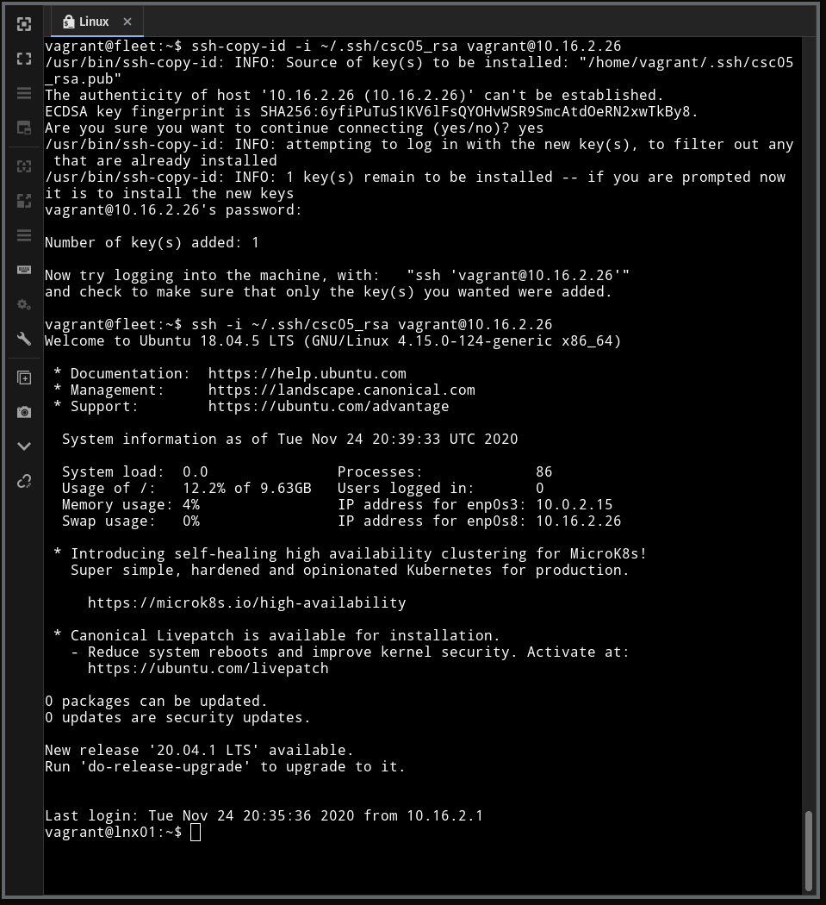

# Lab 5: SIEM com Fleet (OSquery 02)

- **Disciplina:** CSC-05: Operações Cibernéticas e Jogos de Guerra Cibernética - Lado Defesa
- **Aluno:** Gianluigi Dal Toso
- **Turma:** 2021
- **Data:** 20/11/2020

Este relatório também pode ser conferido online (em formato Markdown) pela URL: [CSC-05: Lab 5-2](https://gitlab.com/gitoso/csc-05/-/tree/master/Lab%205-2)

---

Neste relatório serão descritos os passos realizados ao seguir o roteiro disponível para o _Laboratório 5: SIEM com Fleet (OSquery 02)_.

<!-- A execução do laboratório foi gravada no formato _asciinema_ (gravação do terminal, sem intervalo entre comandos). Para cada subseção à seguir, serão disponibilizados os links referentes as gravações. -->

O Laboratório foi executado no ambiente Linux remoto com OpenStack fornecido para o Exame, que possui as seguintes características:
- **Sistema Operacional**: Ubuntu 18.05.5 LTS x86_64 (4.15.0-115-generic)
- **CPU**: Intel Xeon E312xx (4) @ 2.194GHz 
- **RAM**: 34 GB
- **GPU**: Red Hat, Inc. QXL paravirtual graphic card   


Para cada sessão do relatórios, será inserida uma captura de tela referente indicando a execução do laboratório.

## <a name='TabeladeContedos'></a>Tabela de Conteúdos


<!-- vscode-markdown-toc -->


COLOCAR UMA TOC AQUI

<!-- vscode-markdown-toc-config
	numbering=false
	autoSave=true
	/vscode-markdown-toc-config -->
<!-- /vscode-markdown-toc -->

---


## Pré-Lab: Instalar três VMs, uma com o SIEM, uma com Linux e outra com Windows via vagrant

1) Vamos verificar que as 3 VMs estão rodando apropriadamente.

```
vagrant up
vboxmanage list runningvms
```

---
**Screenshot:**


```
vagrant status
```
---
**Screenshot:**


2) Verificar que as 3 VMs estão acessível via rede interna “privada” 10.16.2.25, 10.16.2.26 e 10.16.2.20 (a maquina Windows pode bloquear o ping)

---
**Screenshot:**


De fato a máquina Windows parece estar bloquando o ping.

A partir de uma máquina (entrando via `vagrant ssh`) é possível pingar a outra mostrando que existe conectividade entre as máquinas.

---
**Screenshot:**


## Topologia e Instalação da Infraestrutura de Containers e Ansible

Para esse exercício, ao invés de instalarmos e configurarmos os daemons dos sistemas do Fleet, bem como seu banco de dados acessório e outros recursos, vamos, ao invés, fazer uso reforçado de “containers docker” para que nosso SIEM tenha um footprint tal como ilustrado no enunciado do laboratório.

2) Instalando docker e docker-compose. A instalação do gerenciador de containers chamado Docker é feito por chamada de linha de comando no ambiente da máquina controladora que chamo de “fleet”.

```
user@suamaquina:~$ vagrant ssh fleet
vagrant@fleet:~$ sudo apt update
vagrant@fleet:~$ sudo apt -y install docker.io
```

---
**Screenshot:**


O docker vem configurado para ser trabalhado somente por nível de superusuário, mas isso pode ser inconveniente, por causa dos comandos “sudo” para tudo no ambiente docker. Portanto, uma opção é configurar o usuário “vagrant” para pertencer ao grupo docker. É preciso sair do seu usuário para ter efeito o comando.

```
vagrant@fleet:~$ sudo usermod -aG docker $USER
vagrant@fleet:~$ exit
user@suamaquina:~$ vagrant ssh fleet
vagrant@fleet:~$ docker ps
```

---
**Screenshot:**


3) Outro aplicativo que iremos usar para acelerar o levantamento do ambiente do Fleet é o ANSIBLE. Eu já falei desse aplicativo em outro momento na aula. É um sistema automático de instalação de pacotes e de configuração para máquinas Linux ou Windows. A partir dele, faremos toda a configuração de maneira remota nas máquinas Linux e Windows.

```
vagrant@fleet:~$ sudo apt -y install ansible
vagrant@fleet:~$ ansible --version
```

---
**Screenshot:**


4) Instalação do docker-compose

O docker-compose é uma ferramenta complementar ao DOCKER que permite a criação de “pilhas de aplicação” interconectadas. Ou seja, ela traz os vários containers necessários e interconecta os mesmos preparando um ambiente de microserviços.

No primeiro comando, faz-se uso do “curl” que é um programa para baixar coisas da internet. No caso específico, eu vou até o diretório no github que contém todos os releases do docker-compose e busco a versão específica 1.26.0, e trago o binário baseado no SO e arquitetura do computador da minha VM (no caso Linux, x86_64). Finalmente, já baixo o binário para a pasta /usr/local/bin que é uma pasta que normalmente está no PATH. O segundo comando permite a execução por qualquer usuário do docker-compose. E finalmente executo o comando com o parâmetro version para ver se a versão esta correta.

```
vagrant@fleet:~$ sudo curl -L https://github.com/docker/compose/releases/download/1.26.0/docker-compose-`uname -s`-`uname -m` -o /usr/local/bin/docker-compose
vagrant@fleet:~$ sudo chmod +x /usr/local/bin/docker-compose
vagrant@fleet:~$ docker-compose version
```

---
**Screenshot:**


## Instalação dos Softwares de Containers para o Fleet

O arquivo abaixo é o docker compose necessário para levantar o Kolide Fleet para gerenciar nós com osquery. São necessários 2 bancos de dados, o banco de dados mysql (relacional) e o banco de dados redis (não-relacional). Cada banco de dados é chamada de “services” no docker-compose e tem uma configuração específica, por exemplo uso de senhas, no caso do usuário MYSQL é setada uma senha de root – “toor” (root ao contrário) e um usuário de banco de dados “fleet”.

```
version: '3.7'
services:

    mysql01:
        image: mysql:5.7
        volumes:
         - .:/data
        command: mysqld --datadir=/tmp/data --event-scheduler=ON
        environment:
            MYSQL_ROOT_PASSWORD: toor
            MYSQL_DATABASE: fleet
            MYSQL_USER: fleet
            MYSQL_PASSWORD: fleet
        ports:
         - "3306:3306"

    redis01:
        image: redis:3.2.4
        ports:
         - "6379:6379"

    fleet01:
        image: kolide/fleet:latest
        command: sh -c "/usr/bin/fleet prepare db --no-prompt && /usr/bin/fleet serve"
        environment:
            KOLIDE_MYSQL_ADDRESS: mysql01:3306
            KOLIDE_MYSQL_DATABASE: fleet
            KOLIDE_MYSQL_USERNAME: fleet
            KOLIDE_MYSQL_PASSWORD: fleet
            KOLIDE_REDIS_ADDRESS: redis01:6379
            KOLIDE_SERVER_ADDRESS: 0.0.0.0:8412
            KOLIDE_AUTH_JWT_KEY: FdxvIZiar2EQXE3azq30An1YpwcSQSwk
            KOLIDE_SERVER_CERT: /fleet/osquery/fleet.crt
            KOLIDE_SERVER_KEY: /fleet/osquery/fleet.key
            KOLIDE_LOGGING_JSON: 'true'
            KOLIDE_OSQUERY_STATUS_LOG_PLUGIN: filesystem
            KOLIDE_FILESYSTEM_STATUS_LOG_FILE: /logs/osqueryd.status.log
            KOLIDE_OSQUERY_RESULT_LOG_PLUGIN: filesystem
            KOLIDE_FILESYSTEM_RESULT_LOG_FILE: /logs/osqueryd.results.log
        depends_on:
         - mysql01
         - redis01
        volumes:
         - .:/fleet/
         - fleet_logs:/logs
        ports:
         - "8412:8412"
        volumes:
        fleet_logs:
        driver: local
        driver_opts:
        o: bind
        type: none
        device: /opt/fleet_logs
```

Também é especificado a porta do MYSQL que será exportada 3306. Outros containers tem arquivos de configuração que são passados para os containers, como os certificados auto-assinados (fleet.crt e fleet.key) que vão ser necessários. O Redis é bem simples não tem nenhuma configuração extra.

E o “service” fleet é bem envolvido, ele tem dependência dos bancos de dados para rodar, ele tem um diretório no dispositivo (na VM) onde ficarão os logs do fleet. Ele tem uma série de configurações de variáveis de ambiente `KOLIDE_`. E a execução dele se dá pelo comando prepare-db e fleet-serve.

5) Copie o arquivo acima como docker-compose.yml

---
**Screenshot:**


6) Criar um diretório fleet que será usado para armazenar os certificados digitais que serão usados para fornecer o acesso TLS entre os clientes o servidor FLEET central. Após a criação do diretório, entrar no diretório e criar o certificado, que estará atrelado ao nome de domínio “fleet.local”, conforme comando 3 abaixo.

```
vagrant@fleet:~$ sudo mkdir /opt/fleet_logs
vagrant@fleet:~$ mkdir osquery
vagrant@fleet:~$ touch ~/.rnd
vagrant@fleet:~$ cd osquery
vagrant@fleet:~/osquery $ openssl req -new -nodes -x509 -days 3650 -subj "/C=BR/ST=SP/L=SaoPaulo/O=CSC05/CN=fleet.local" -keyout fleet.key -out fleet.crt
```

---
**Screenshot:**


7) Após a preparação de diretório e arquivos que serão usados pelo docker- compose, basta a) salvar o arquivo mostrado na pagina anterior com o nome docker-compose.yml no diretório HOME e executar o comando “docker-compose up”. Esse comando vai rodar todos os containers em modo “daemon” e vai exibir um log para mostrar que está tudo funcionando corretamente.

```
vagrant@fleet:~$ cd ~
vagrant@fleet:~$ docker-compose up -d && docker-compose logs -f
```

Vai baixar os containers pertinentes primeiro e criar os volumes (discos) locais do docker. E a medida que os serviços forem subindo vai aparecer na tela. Depois o mysql. E por fim o fleet, que estará esperando na porta 8412.

---
**Screenshots:**


Se você estiver na mesma maquina que esta a VM, basta abrir o seu browser no endereço https://10.16.2.25:8412 (no meu caso, onde faço acesso a VM remotamente de uma máquina de casa, preciso configurar um túnel SSH com o comando: ssh -L 8412:10.16.2.25:8412 cesar@192.168.15.93) e o meu acesso por browser é https://localhost:8412

(Aqui foi necessário também configurar o túnel SSH exatamente como o específicado acima. Além disso, precisei alterar o Vagrantfile e fazer o redirecionamento 8142 => 8142)

---
**Screenshot:**


## Configuração do Ambiente Web do Fleet

8) Acessar o Fleet pelo browser

---
**Screenshot:**


Copiar a chave secreta (enroll secret), ela vai ser necessário no próximo passo, de instalação dos endpoints. Neste caso eu copiei e salvei em um arquivo local.

## Instalação dos Softwares Osquery nos endpoints Linux de maneira automatizada e Cadastro Automático no Fleet

9) Criação de arquivos de configuração para o Ansible, começando pelo arquivo hosts

O arquivo hosts referência e coloca nome nos servidores, de modo a configurar de uma só vez, os ambientes de osquery remotamente. Além disso, todo tipo de atividade ansible pode ser realizada remotamente com esse ferramental.

Arquivo: `hosts`
```
[linuxapps]
server0 ansible_host=10.16.2.26

[winapps]
server2 ansible_host=10.16.2.20

[all:vars]
ansible_python_interpreter=/usr/bin/python3
```

Além do arquivo hosts é preciso definir em ansible o método de acesso remoto. Em geral, o método de acesso é por SSH ou WINRM do Windows. Aqui nesse exemplo, farei o acesso por senha, mas o recomendável seria uma acesso por “chave criptográfica”. Ambos esses arquivos abaixo de acesso remoto ficam no diretório “./group_vars”

Arquivo: `linuxapps.yml`
```
ansible_ssh_user: vagrant
ansible_ssh_private_key_file: ~/.ssh/csc05_rsa
ansible_become: true
ansible_become_user: root
ansible_connection: ssh
```

Arquivo: `winapps.yml`
```
ansible_user: vagrant
ansible_password: vagrant
ansible_port: 5986
ansible_connection: winrm
ansible_winrm_transport: ntlm
ansible_winrm_server_cert_validation: ignore
```

O ANSIBLE trabalha com a ideia básica de playbooks. Esses playbooks são passo a passo de execuções de instalação de pacotes, de configuração de itens, entre outros. Nesses arquivos abaixo, faremos os playbooks de instalação do procedimento para Linux e para Windows. O sistema de playbooks do Ansible é bastante sofisticado e tem um sub-sistema de “pacotes” ou seja, playbooks modulares prontos para uso. Faremos uso do módulo “apolloclark.osquery” para a instalação do OSQUERY nas máquinas Linux remotamente.

Arquivo: `linux-osqueryd.yml`
```
- hosts: linuxapps
  roles:
    - apolloclark.osquery
```

Arquivo: `update-linux-osqueryd.yml`
```
- hosts: linuxapps
  tasks:
  - name: Get cert for Kolide
    shell: python3 -c "import ssl; print (ssl.get_server_certificate(('fleet.local', 8412)))" | sudo tee /etc/osquery/certificate.crt

  - name: Copy OSQuery flags file
    template:
      src: osquery.flags
      dest: /etc/osquery/osquery.flags
      owner: root
      group: root
      mode: '0600'

  - name: Copy OSQuery secret
    template:
      src: osquery/fleet.key
      dest: /etc/osquery/osquery.key
      owner: root
      group: root
      mode: '0600'

  - name: Restart osquery
    service:
      name: "osqueryd"
      state: restarted
```

Arquivo `windows-osqueryd.yml`
```
- hosts: winapps
  tasks:
  - name: Install OSQuery with chocolatey
    win_chocolatey:
      name: osquery
      params: "/InstallService"
      state: latest

  - name: Get certificate
  win_template:
    src: osquery/fleet.crt
    dest: C:\Program Files\osquery\certs\certificate.crt

  - name: Copy OSQuery.flags
    win_template:
      src: osquery-windows.flags
      dest: C:\Program Files\osquery\osquery.flags

  - name: Copy OSQuery.key
    win_template:
      src: osquery/fleet.key
      dest: C:\Program Files\osquery\osquery.key

- name: Start OSQuery service
  win_service:
    name: osqueryd
    start_mode: auto
    state: restarted
```

10) Passos de configuração para a instalação do osquery. São necessários alguns passos anteriores para preparação do ambiente. Gerar uma chave criptográfica para acesso à maquina Linux.

```
vagrant@fleet:~$ ssh-keygen -t rsa -b 4096
```

---
**Screenshot:**


11) A maquina lnxquery é baseada em ubuntu18, todas elas vem com default desabilitado o acesso por SSH por senha, é preciso alterar isso. Para permitir o primeiro acesso por senha, e copiar a chave criptográfica csc05_rsa para posterior uso via ansible.

```
vagrant@fleet:~$ exit
user@suamaquina:~$ vagrant ssh lnxosquery
vagrant@lnx01:~$ ifconfig # verificação se esta na VM
vagrant@lnx01:~$ sudo sed -i "s/PasswordAuthentication no/PasswordAuthentication yes/" /etc/ssh/sshd_config
vagrant@lnx01:~$ sudo systemctl restart sshd
vagrant@lnx01:~$ exit
user@suamaquina:~$ vagrant ssh fleet
vagrant@fleet:~$ ssh vagrant@10.16.2.26
```

---
**Screenshots:**


12) Também precisamos adicionar o “endereço legitimo” fleet.local para as máquinas remotas começando pela máquina Linux, para isso é preciso fazer ssh para a maquina lnx01 e verificar que a configuração funcionou.

```
vagrant@lnx01:~$ echo '10.16.2.25 fleet.local fleet.local' | sudo tee -a /etc/hosts
```

---
**Screenshot:**


13) Finalmente é preciso copiar a chave criptográfica para Linux e fechar o acesso por senha e testar. E depois testar se o ansible funciona comunicando.

```
vagrant@fleet:~$ ssh-copy-id -i ~/.ssh/csc05_rsa vagrant@10.16.2.26
vagrant@fleet:~$ ssh -i ~/.ssh/csc05_rsa vagrant@10.16.2.26
vagrant@lnx01:~$ sudo sed -i "s/PasswordAuthentication yes/PasswordAuthentication no/" /etc/ssh/sshd_config
vagrant@lnx01:~$ sudo systemctl restart sshd
vagrant@lnx01:~$ exit
vagrant@fleet:~$ ansible -i hosts linuxapps -m ping
```

---
**Screenshots:**



14) Instalação do Osquery via ansible

```
vagrant@fleet:~$ ansible-galaxy install apolloclark.osquery
```

---
**Screenshot:**


```
vagrant@fleet:~$ ansible-playbook -i hosts linux-osqueryd.yml
```

---
**Screenshot:**


15) O último passo da instalação do ansible / osquery precisa que a “chave de enrollment” tenha sido instalada no osquery cliente (na maquina Linux). Copie o conteúdo do segredo em texto da pagina web do Fleet da “enroll secret”. A última tela do Fleet que apareceu na página 10. Por exemplo, no meu caso é a senha é o texto abaixo, que copiei nesse comando abaixo e sobreescrevi o arquivo fleet.key. E depois execute uma atualização dos arquivos de configuração do osquery via ansible.

```
vagrant@fleet:~$ echo "TSJYeb3KIUbSq5J+zA/fXDwVIg1CpF0d" > ~/osquery/fleet.key
```

---
**Screenshot:**


16) Precisamos criar um arquivo de configuração que será copiado na máquina remota. Esse arquivo tem como elementos, a configuração do túnel criptográfico específico das máquinas Linux osquery para o fleet. Em especial nessa configuração, note que temos o “fleet.local” como o hostname.

Arquivo: `osquery.flags`
```
--tls_server_certs=/etc/osquery/certificate.crt
--enroll_secret_path=/etc/osquery/osquery.key
--tls_hostname=fleet.local:8412
--host_identifier=uuid
--enroll_tls_endpoint=/api/v1/osquery/enroll
--config_plugin=tls
--config_tls_endpoint=/api/v1/osquery/config
--config_tls_refresh=10
--disable_distributed=false
--distributed_plugin=tls
--distributed_interval=10
--distributed_tls_max_attempts=3
--distributed_tls_read_endpoint=/api/v1/osquery/distributed/read
--distributed_tls_write_endpoint=/api/v1/osquery/distributed/write
--logger_plugin=tls
--logger_tls_endpoint=/api/v1/osquery/log
--logger_tls_period=10
```

---
**Screenshot:**


17) Após esse passo, atualizar o osquery com a chave de enrollment e com a configuração para o servidor fleet.

```
vagrant@fleet:~$ ansible-playbook -i hosts update-linux-osqueryd.yml
```

---
**Screenshot:**


18) Sucesso. Maquina Linux sendo gerenciada pelo ambiente Fleet. O mesmo procedimento poderia ser feito para dezenas e centenas de Linux de maneira automatizada.

---
**Screenshot:**


## Instalação dos Softwares Osquery nos endpoints Windows de maneira automatizada e Cadastro Automático no Fleet

19) Instalação de pacotes no controlador para acesso remoto na maquina Windows. Como o acesso é via WINRM, o ansible precisa de um pacote python para instalar o suporte ao winrm, pacote pywinrm.

```
vagrant@fleet:~$ sudo apt -y install python-pip
vagrant@fleet:~$ pip install pywinrm
```

---
**Screenshots:**


20) Do lado da maquina Windows precisa de alguns passos também para seu acesso remoto via Ansible. Então precisa acessar a máquina via RDP ou acesso direto, se você conseguir acessar a VM via Virtualbox. E depois entrar no POWERSHELL com acesso privilegiado.

(eu faço o meu acesso via RDP remotamente, na VM, usando túnel SSH veja que o IP do túnel aponta para a maquina Windows com final .20 – ssh -L 3389:10.16.2.20:3389 cesar@192.168.15.93)

Copie e cole no powershell administrativo, os 4 comandos em powershell para baixar e configurar o acesso via ANSIBLE para as maquinas Windows.

...