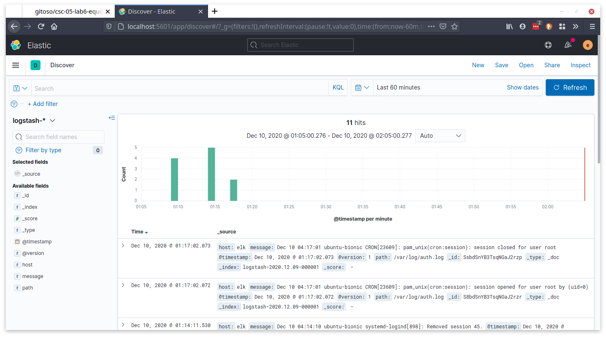
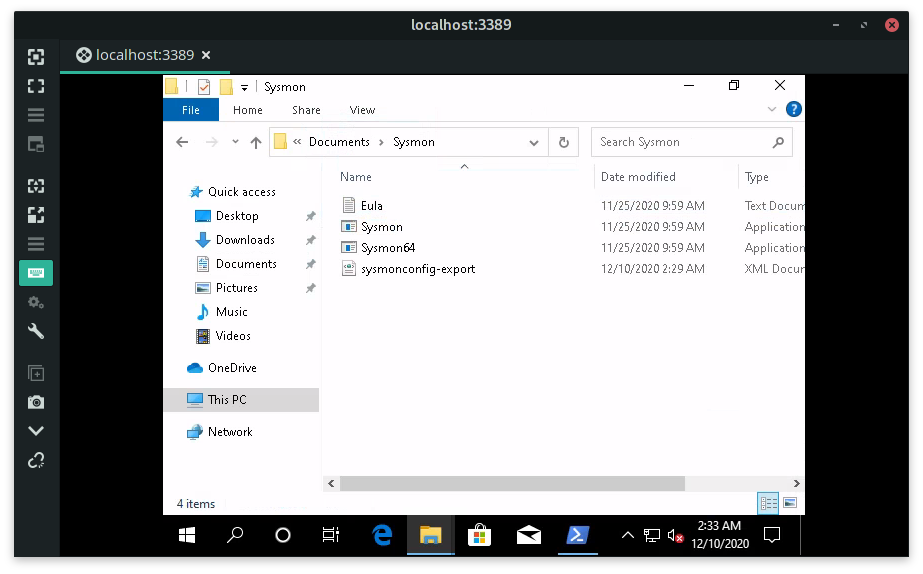

# Lab 6: Laboratório de Elasticsearch

Esta atividade foi realizada em equipe e o repositório original encontra-se no GitHub. Este é apenas um "mirror". [Repositório Original](https://github.com/gitoso/csc-05-lab6-equipe)

- **Disciplina:** CSC-05: Operações Cibernéticas e Jogos de Guerra Cibernética - Lado Defesa
- **Alunos:** 
    - Felipe dos Santos Bomfim
    - Gianluigi Dal Toso
    - Guilherme Goulart Kowalczuk
    - Pedro Henrique da Silva Dias 
    - Raphael de Vasconcelos Nascimento
- **Data:** 11/12/2020

Este relatório também pode ser conferido online (em formato Markdown) pela URL: [Laboratório 6: Elasticsearch](https://github.com/gitoso/csc-05-lab6-equipe)

---

Neste relatório serão descritos os passos realizados ao seguir o roteiro disponível para o _Laboratório 6: Elasticsearch_.


O Laboratório foi executado no seguinte ambiente:
- **Sistema Operacional**: Ubuntu 18.04.1 x64 (5.4.0-56-generic)
- **CPU**: Intel i7-6700K
- **RAM**: 62 GB


**Tabela de Conteúdos**:

<!-- vscode-markdown-toc -->

* [Laboratório de Elasticsearch](#LaboratriodeElasticsearch)
* [Instalação dos Softwares Necessários](#InstalaodosSoftwaresNecessrios)
* [Adicionando dados de exemplo no Kibana e colocando autenticação](#AdicionandodadosdeexemplonoKibanaecolocandoautenticao)
* [Capturando dados de autenticação de linux](#Capturandodadosdeautenticaodelinux)
* [Capturando dados de eventos de sistema do windows](#Capturandodadosdeeventosdesistemadowindows)

<!-- vscode-markdown-toc-config
	numbering=false
	autoSave=true
	/vscode-markdown-toc-config -->
<!-- /vscode-markdown-toc -->

---

## <a name='LaboratriodeElasticsearch'></a>Laboratório de Elasticsearch

Voce é o super CISO (Chief information security officer) da sua instituição e está com uma missão de colocar um SIEM para rodar no seu ambiente. Nesse laboratório faremos a instalação completa do ambiente ELK (Elasticseach, Logstash e Kibana) onde faremos monitoração de sistemas de logs do sistema do linux, de eventos de Windows, de regras de firewall e finalmente usaremos os resultados do lab anterior para também dar suporte ao OSQUERY.

### <a name='VamoscomearcomumcenriosimplesdeinstalaodoambienteELK.Paraessecenriovamosusar2VMscontendoemumamquinaqueseroELKeemoutraalgoasermonitorado.IremosportantoreaproveitaroVagrantfiledolabpassado.Eacionarsomenteasmquinasqueformosnecessitando.'></a>1) Vamos começar com um cenário simples de instalação do ambiente ELK. Para esse cenário vamos usar 2 VMs contendo em uma máquina que será o ELK e em outra, algo a ser monitorado. Iremos, portanto reaproveitar o Vagrantfile do lab passado. E acionar somente as máquinas que formos necessitando.

No diretório do arquivo Vagrantfile.original:

```
user@suamaquina:~$ sed "s/fleet/elk/g" Vagrantfile.original | sed "s/osquery/elk/g" > Vagrantfile
user@suamaquina:~$ vagrant up elk
```

---
**Screenshots**:


## <a name='InstalaodosSoftwaresNecessrios'></a>Instalação dos Softwares Necessários

### <a name='SeguiratpaginawebdaElasticsearch-https:www.elastic.coelasticsearch'></a>2) Seguir até pagina web da Elasticsearch - https://www.elastic.co/elasticsearch/


```
vagrant@elk:~$ sudo apt update
```

Depois da sagrada atualização. Vamos copiar o link desse download da pagina web e copiar diretamente da página web para a VM.

```
vagrant@elk:~$ wget https://artifacts.elastic.co/downloads/elasticsearch/elasticsearch-7.10.0-amd64.deb
vagrant@elk:~$ sudo dpkg -i elasticsearch-7.10.0-amd64.deb
```

Essa instalação será feita como um serviço “daemon” do elasticsearch, portanto, ele vai rodar e ser gerenciado via “systemctl”. Estamos fazendo mais transparente do que a ultima vez, lab05 para mostrar como o Ansible faz as instalações por debaixo dos panos.

Para um novo serviço estar disponível, precisamos recarregar a lista de “daemons”

```
vagrant@elk:~$ sudo systemctl daemon-reload
```

Em seguida o comando “ENABLE”, habilita o daemon para ser acionado mesmo após o reinicio da maquina, ou seja, entre boot.

```
vagrant@elk:~$ sudo systemctl enable elasticsearch.service
```

E finalmente, vamos acionar o serviço pela primeira vez.

```
vagrant@elk:~$ sudo systemctl start elasticsearch.service
```

Para ver que o serviço está funcionando tem várias maneiras, vamos apresentar 3 maneiras.
- a) Processo elasticsearch está rodando na maquina:

```
vagrant@elk:~$ ps aux | grep elastic
```

Algumas características do programa “banco de dados” elasticsearch, ele tem um executável próprio java, que executa com uma parametrização de memória de 1GB, e passa os arquivos de logs e erros como parâmetro.

- b) `vagrant@elk:~$ curl -X GET localhost:9200`

Um teste mais profundo, consiste em fazer um acesso via porta 9200, e acessar o elasticsearch via sua API. O método GET obtém como resposta um arquivo JSON contendo a descrição da versão do elasticsearch instalado entre outras informações.

- c) `vagrant@elk:~$ sudo cat /var/log/elasticsearch/elasticsearch.log`

O arquivo de log é bem extenso, não vou imprimir. E os últimos dois comandos são relacionados ao acionamento via systemctl do daemon e podem exibir informações se o serviço estiver “active (running)”.

- d) `vagrant@elk:~$ sudo journalctl -u elasticsearch -r`

- e) `vagrant@elk:~$ sudo systemctl status elasticsearch.service`

---
**Screenshots**:


### <a name='InstalaodoLogstash'></a>3) Instalação do Logstash

Para a instalação dos próximos programas Logstash e Kibana que são baseados em Java. Caso não seja instalado na mesma máquina do elasticsearch, será necessário instalar o Java Runtime na máquina ELK. Senão o java run time do Elasticsearch permanece sendo usado.

```
vagrant@elk:~$ sudo apt install -y openjdk-11-jre
```

Depois na mesma página web do Elastic, procurar pelo logstash download on-prem. O link já esta aqui embaixo.

```
vagrant@elk:~$ wget https://artifacts.elastic.co/downloads/logstash/logstash-7.10.0-amd64.deb
vagrant@elk:~$ sudo dpkg -i logstash-7.10.0-amd64.deb
vagrant@elk:~$ sudo systemctl daemon-reload
vagrant@elk:~$ sudo systemctl enable logstash.service
```

Verifique que os passos são muito semelhantes do elasticsearch. Porém antes de finalizar e iniciar o serviço, vamos fazer uma pequena modificação na configuração.

A configuração extra é para reiniciar o serviço, toda vez que tiver uma modificação no diretório “conf.d” onde serão criados os pipelines de processamento do logstash. Serão criados pipelines para processamento de audit do Linux e dos processos do Windows.

```
#### uma maneira de fazer é sudo vim /etc/logstash/logstash.yml
#### e procurar pelas palavras "config.reload.automatic" e "reload.interval=3s"

vagrant@elk:~$ sudo sed -i "s/\# config.reload.automatic: false/config.reload.automatic: true/g" /etc/logstash/logstash.yml
vagrant@elk:~$ sudo sed -i "s/\# config.reload/config.reload/g" /etc/logstash/logstash.yml
vagrant@elk:~$ sudo systemctl start logstash.service
```

Para verificar que foi instalado corretamente:

```
vagrant@elk:~$ ps aux | grep logstash
vagrant@elk:~$ sudo journalctl -u logstash -r
vagrant@elk:~$ sudo cat /var/log/logstash/logstash-plain.log
```

---
**Screenshots**:


### <a name='InstalaodoKibana'></a>4) Instalação do Kibana

Kibana é a ferramenta de visualização de dados do elasticsearch. Permite a criação de visualizações e dashboards interessantes. Também escrito em java e tb faz parte do ecossistema de ferramentas da Elastic. Para encontrar o link é só ir na página web da ElasticSearch.

```
vagrant@elk:~$ wget https://artifacts.elastic.co/downloads/kibana/kibana-7.10.0-amd64.deb
vagrant@elk:~$ sudo dpkg -i kibana-7.10.0-amd64.deb
vagrant@elk:~$ sudo systemctl daemon-reload
vagrant@elk:~$ sudo systemctl enable kibana.service
```

Novamente, antes do início do aplicativo para execução vamos fazer algumas pequenas modificações, para que o Kibana APONTE para o Elasticsearch e portanto, faça uso da API do Elasticsearch para fazer as buscas e processamentos gráficos.

```
# editar fazendo uso de vim /etc/kibana/kibana.yml , a editar o campo “elasticsearch.hosts” como e o server.host para apontar para o endereço IP da VM, ou a versão mais simples com substituição

vagrant@elk:~$ sudo sed -i "s/\#elasticsearch.hosts/elasticsearch.hosts/g" /etc/kibana/kibana.yml
vagrant@elk:~$ sudo sed -i "s/\#server.host: \"localhost/server.host: \"10.16.3.27/g" /etc/kibana/kibana.yml
```

Se tudo tiver certo, após o início do serviço Kibana, será possível navegar na página web do Kibana.

```
vagrant@elk:~$ sudo systemctl start kibana.service
vagrant@elk:~$ ps -ef | grep kibana
vagrant@elk:~$ sudo journalctl -u kibana -r
```

---
**Screenshots**:


### <a name='ExecuodapginawebdoKibanaseestiverrodandonamesmamquinahostqueaVMpodeapontarobrowserparahttp:10.16.2.25:5601senofazerusodetnelssh-L5601:10.16.2.25:5601cesar192.168.15.93eusandoobrowserapontarparahttp:localhost:5601.'></a>5) Execução da página web do Kibana, se estiver rodando na mesma máquina host que a VM, pode apontar o browser para http://10.16.2.25:5601, senão fazer uso de túnel ssh -L 5601:10.16.2.25:5601 cesar@192.168.15.93 , e usando o browser apontar para http://localhost:5601.

---
**Screenshots**:


## <a name='AdicionandodadosdeexemplonoKibanaecolocandoautenticao'></a>Adicionando dados de exemplo no Kibana e colocando autenticação

### <a name='Cliqueemadicionardadoseselecionedadosweblogapache.'></a>6) Clique em adicionar dados e selecione dados web log apache.

Ao selecionar “apache logs”, o kibana vai explicar como configurar o apache para recolher logs e demonstrar as linhas de comando para faze-lo. Depois irá para uma tela com algumas opções de “sample logs”, escolha “Sample web logs” e depois “view data / dashboard”.

A dashboard de logs de apache, que registra os acessos a um servidor web é muito bem feito, com todos os recursos que você poderá encontrar no Kibana para uma visualização de dados.

---
**Screenshots**:


### <a name='TambmpossvelnavegarnosdadosbrutospormeiodomenudoKibananocantosuperioresquerdo.SelecioneDiscovery.Vejaqueosdadossorepresentadosdemltiplasmaneiras.Tem-seumhistogramadeeventos.Temososregistrosindividuaisdoseventoscomseusvrioscampos.possvelnavegarnessesregistroseobterinformaesdetalhadas.possvelrealizarbuscaportemponosdadosebuscaKQLdiretamentenosdados.'></a>7) Também é possível navegar nos dados brutos, por meio do menu do Kibana no canto superior esquerdo. Selecione “Discovery”. Veja que os dados são representados de múltiplas maneiras. Tem-se um histograma de eventos. Temos os registros individuais dos eventos com seus vários campos. É possível navegar nesses registros e obter informações detalhadas. É possível realizar busca por tempo nos dados, e busca KQL diretamente nos dados.

---
**Screenshots**:


### <a name='ColocandoconfiguraesdeseguranaparaacessoaoservidorElasticsearcheKibana.'></a>8) Colocando configurações de segurança para acesso ao servidor Elasticsearch e Kibana.

Vamos começar parando os serviços do kibana e elasticsearch para alterar suas configurações.

```
vagrant@elk:~$ sudo systemctl stop kibana.service
vagrant@elk:~$ sudo systemctl stop elasticsearch.service
```

Edite /etc/elasticsearch/elasticsearch.yml e adicione no final do arquivo, as seguintes linhas:
a) xpack.security.enabled: true e b) discovery.type: single-node ou a maneira mais fácil

```
vagrant@elk:~$ echo 'xpack.security.enabled: true' | sudo tee -a /etc/elasticsearch/elasticsearch.yml
vagrant@elk:~$ echo 'discovery.type: single-node' | sudo tee -a /etc/elasticsearch/elasticsearch.yml
```

---
**Screenshots**:


### <a name='Configurandoassenhasinternasparaoserviodoelasticsearchekibana.'></a>9) Configurando as senhas internas para o serviço do elasticsearch e kibana.

```
vagrant@elk:~$ sudo systemctl start elasticsearch.service
vagrant@elk:~$ sudo /usr/share/elasticsearch/bin/elasticsearch-setup-passwords interactive
```

Vai aparecer um menu explicativo que será dado a chance do usuário configurar as senhas de sistema dos usuários “superusuarios” do elasticsearch. O correto é você criar uma senha bem difícil, por exemplo, usando o site https://passwordsgenerator.net/ e escolher uma senha forte com 16 caracteres misturando tudo o que tem direito. Mas aqui, vamos colocar a senha de todos como “password”.

Após essa configuração, vamos precisar alterar a configuração do Kibana para que ele se autentique com uma dessas contas de sistema, com senha. No caso, teria que alterar o arquivo “sudo vim /etc/kibana/kibana.yml” e alterar os valores de elasticsearch.username: "kibana" e elasticsearch.password: "password". A maneira mais simples é por substituição.

```
vagrant@elk:~$ sudo sed -i "s/\#elasticsearch.username: \"kibana_system/elasticsearch.username: \"kibana/g" /etc/kibana/kibana.yml
vagrant@elk:~$ sudo sed -i "s/\#elasticsearch.password: \"pass/elasticsearch.password: \"password/g" /etc/kibana/kibana.yml
vagrant@elk:~$ sudo systemctl restart kibana.service
```

Verifique se deu tudo certo, com o serviço “rodando”.

```
sudo systemctl status kibana.service
```

---
**Screenshots**:


### <a name='Vamosentrarpelobrowsereverqueagoranecessrioterlogin.'></a>10) Vamos entrar pelo browser e verá que agora é necessário ter login.

Entrar com o usuário “elastic” e senha “password” conforme você definiu anteriormente. E vá até o menu principal do Kibana e procure por “Management” no final da lista. Em Management, tem 2 itens importantes, que usaremos depois, “Dev Tools” – ferramenta raiz para interagir com o elasticsearch via comandos de API e Stack Management, onde podemos criar usuários e também criar “index patterns” que serão usados depois para navegar nos dados e popular dashboards.

---
**Screenshots**:


### <a name='Criarumusurioparavocacessaroelasticsearch.VaiemSecurityUserseclicanobotoCreateUser.'></a>11) Criar um usuário para você acessar o elasticsearch. Vai em “Security / Users” e clica no botão Create User.

---
**Screenshots**:


### <a name='Prontosdarlogouteentrarcomusariocsc05comsenhapassworddaquiprafrente.'></a>12) Pronto, é só dar logout e entrar com usario csc05 com senha password daqui pra frente.

---
**Screenshots**:


## <a name='Capturandodadosdeautenticaodelinux'></a>Capturando dados de autenticação de linux

### <a name='UsaremosologagregadorlogstashparacapturardadosdoarquivodeautenticaodoLinuxetransportarparaoambienteelasticsearchekibana.'></a>13) Usaremos o log agregador logstash para capturar dados do arquivo de autenticação do Linux e transportar para o ambiente elasticsearch e kibana.

Todas as configurações de pipelines do logstash ficam descritas no diretório /etc/logstash/conf.d

No diretório /etc/logstash/ é onde tem algumas configurações padrão do software logstash, como o arquivo logstash.yml que configuramos para atualizar. Nesse laboratório nós vamos configurar dentro do pipeline o acesso por login e senha diretamente.

Conforme expliquei em aula, todos os pipelines são preparados com 3 estágios, o estágio de ingestão de dados (input), o estágio de normalização dos dados (filter) e o estágio de exportação de dados e envio para o banco de dados elasticsearch (output).

Esses 3 estágios são configurados por meio de uma descrição de objetos baseada em JSON, com { } chaves delimitando os contextos dos objetos. Vamos criar um arquivo pipeline puro que chamaremos de template, e depois poderemos configurar tudo a partir desse template.conf

```
vagrant@elk:~$ cd /etc/logstash/
vagrant@elk:~$ ls -l conf.d/
vagrant@elk:~$ sudo vim template.conf

input {

}

filter {

}

output {

}
```

---
**Screenshots**:


### <a name='Ingerirdadosdeauth.logologdasautenticaosudoesshdoLinux'></a>14) Ingerir dados de auth.log, o log das autenticação “sudo” e “ssh” do Linux

Como monitorar logins do sistema, um componente fundamental do gerenciamento de autenticação é monitorar o sistema depois de configurar os usuários e seus acessos. Para isso o Linux registra esses logs em um arquivo chamado /var/log/auth.log que é padrão no Ubuntu.

Voce pode verificar que esse arquivo existe e esta em funcionamento.

```
vagrant@elk:~$ sudo tail /var/log/auth.log
```

---
**Screenshots**:


### <a name='Paraaprendercomoconstruiressespipelinesnologstashexisteumafartadocumentaodeplug-inscomexemplosdeconfiguraonositeelasticsearch.'></a>15) Para aprender como construir esses pipelines no logstash, existe uma farta documentação de plug-ins, com exemplos de configuração no site elasticsearch.

Note que no plugin de input chamado “file”, que faz a leitura de eventos em arquivo, equivalente a um “tail -f”, existe vários parâmetros possíveis para o objeto file, mas o único parâmetro obrigatório é o “path”. E no final da pagina do plugin file tem um exemplo. Vemos que pelo exemplo, os parâmetros são setados pelo símbolo “=>”. No nosso laboratório usaremos um outro parâmetro opcional chamado start_position que é um campo contendo uma string, sendo um desses dois do vetor ["beginning", "end"]. Usaremos o “beginning” para começar a coletar dados desde o início do arquivo.

```
vagrant@elk:~$ sudo cp template.conf conf.d/authlog.conf
```

Editar o arquivo, de modo que fique com essa configuração:

```
input {
    file {
        path => "/var/log/auth.log"
        start_position => "beginning"
    }
}

filter {

}

output {
    elasticsearch {
        hosts => ["localhost:9200"]
        user => csc05
        password => password
    }
}
```

Lembrando que não precisa reiniciar o serviço do logstash porque ele atualiza automaticamente (reload = true) ao detectar um novo arquivo de configuração no diretório conf.d.

Entretanto, se a gente investigar o arquivo de logs veremos uma mensagem de erro.

```
vagrant@elk:~$ tail /var/log/logstash/logstash-plain.log
```

No final temos o error Errno::EACCES: Permission denied - /var/log/auth.log.

O que esta acontecendo é que o arquivo /var/log/auth.log é administrativo do Linux e o usuário logstash não tem permissão de acesso. Portanto, precisamos colocar o logstash como parte do grupo administrativo Linux.

```
vagrant@elk:~$ sudo usermod -a -G adm logstash
```

E depois reinicia o serviço e verifica se esta funcionando corretamente.

```
vagrant@elk:~$ sudo systemctl restart logstash.service
vagrant@elk:~$ tail /var/log/logstash/logstash-plain.log
```
---
**Screenshots**:


### <a name='VerificarqueosdadosestosendoenviadosparaoElasticsearch.'></a>16) Verificar que os dados estão sendo enviados para o Elasticsearch.

No ambiente Kibana, tem uma ferramenta que permite questionar vários aspectos do elasticsearch, através de uma ferramenta de query diretamente em lucene / JSON na API do elasticsearch. Com essa ferramenta, vamos verificar se existe um novo “índice” no elasticsearch. Fica em Management / DevTools. Veja na tela abaixo, que existe um índice novo chamado “logstash-2020.11.14-000001 com 54.6 kb de dados. Entretanto, se você for no “Discover” não vai encontrar os dados crus para manipulação.


---
**Screenshots**:


### <a name='Criarumindexpattern.'></a>17) Criar um index pattern.

Vá até “Stack Manangement” e depois procure por “Index Patterns” dentro da aba Kibana.

Clicar em “Create Index Pattern”

O index pattern pode ser específico, ou pode ser genérico, para fácil ingestão diretamente no Kibana. Um index pattern genérico seria algo como logstash-*. O próximo passo é configurar a “chave primária de indexação”, em geral a chave é o tempo @timestamp, para correlacionar dados.

Com isso, todos os 16 campos de cada evento do auth.log são exportados automaticamente para o kibana para análise.

---
**Screenshots**:


### <a name='VoltaraHomenoKibanaedepoisnomenubuscaKIBANADISCOVER.Dessaveztemumaopoamaisdeindexpatternchamadalogstash-.'></a>18) Voltar a Home no Kibana e depois no menu, busca KIBANA – DISCOVER. Dessa vez tem uma opção a mais de “index pattern” chamada logstash-*.

---
**Screenshots**:


### <a name='Sucessonaaplicaoauth.'></a>19) Sucesso na aplicação auth.

Seria possível segmentar as mensagens de auth.log para obter mais informações úteis como quais comandos deram sudo e quais os acessos ssh. De maneira informativa, essa página web traz esse tipo de execução: https://www.elastic.co/blog/grokking-the-linux-authorization-logs

---
**Screenshots**:


## <a name='Capturandodadosdeeventosdesistemadowindows'></a>Capturando dados de eventos de sistema do windows

### <a name='LevantaramaquinaWindowseinstalarWinlogbeateSysmon.'></a>20) Levantar a maquina Windows e instalar Winlogbeat e Sysmon.

```
user@suamaquina:~$ vagrant up winelk
```

---
**Screenshots**:


### <a name='AcessaramaquinaWindowsremotamentenomeucasoviatnelsshcomssh-L3389:10.16.2.20:3389cesar192.168.15.93'></a>21) Acessar a maquina Windows remotamente (no meu caso via túnel ssh) com ssh -L 3389:10.16.2.20:3389 cesar@192.168.15.93

---
**Screenshots**:


### <a name='PrecisamosbaixarosprogramasnecessriosvamosiniciarpeloSysmon.'></a>22) Precisamos baixar os programas necessários, vamos iniciar pelo Sysmon.

O Monitor do Sistema (Sysmon) é um serviço do sistema Windows e driver de dispositivo que, uma vez instalado em um sistema, permanece residente durante as reinicializações do sistema para monitorar e registrar a atividade do sistema no log de eventos do Windows. Ele fornece informações detalhadas sobre criações de processos, conexões de rede e alterações na hora de criação de arquivos. Ao coletar os eventos que ele gera usando agentes SIEM e, posteriormente, analisá-los, você pode identificar atividades maliciosas ou anômalas e entender como intrusos e malware operam em sua rede. Ele é parte do site “Windows SysInternals” que é para usuários avançados de Windows.

https://docs.microsoft.com/en-us/sysinternals/downloads/sysmon

O arquivo zippado contém dois binários de instalação de 32 bits e 64 bits. Mas nós iremos realizar uma configuração customizada no Sysmon que vai nos permitir ir a fundo nos detalhes do Windows. Essa configuração é feita publicamente pela SwiftonSecurity. Trata-se de um modelo de arquivo de configuração Sysmon com rastreamento de evento de alta qualidade.

https://github.com/SwiftOnSecurity/sysmon-config

No powershell (como administrador) baixar o programa e a configuração.

```
(New-Object System.Net.WebClient).DownloadFile("https://download.sysinternals.com/files/Sysmon.zip", "C:\Windows\Temp\Sysmon.zip")
(New-Object System.Net.WebClient).DownloadFile("https://raw.githubusercontent.com/SwiftOnSecurity/sysmon-config/master/sysmonconfig-export.xml", "C:\Windows\Temp\sysmonconfig-export.xml")  
```

Descompactar o arquivo zippado do sysmon.zip de c:\windows\temp. Copia o arquivo de configuração para o mesmo diretório e finalizar o comando com a execução do comando.

```
.\Sysmon64.exe -i .\sysmonconfig-export.xml
```
---
**Screenshots**:



### <a name='Instalaodowinlogbeats.'></a>23) Instalação do winlogbeats.

https://www.elastic.co/downloads/beats/winlogbeat

Acessar o site e baixar o binário para instalação.

```
(New-Object System.Net.WebClient).DownloadFile("https://artifacts.elastic.co/downloads/beats/winlogbeat/winlogbeat-7.10.0-windows-x86_64.zip", "C:\winlogbeat-7.10.0-windows-x86_64.zip")
```

Descompactar na pasta, e trocar o conteúdo do arquivo de configuração mínima winlogbeat.yml.

O arquivo de configuração do winlogbeat vai filtrar por eventos mais importantes, no sistema de eventos do Windows tem as classes de eventos, como eventos de Aplicação, eventos de segurança, e eventos de Sistema. Existe muita documentação sobre eventos do Windows, um dos locais para pesquisar seria em: https://www.ultimatewindowssecurity.com/securitylog/encyclopedia/

Embora os logs do Windows estejam sendo filtrados por id, no caso dos eventos do Sysmon que são mais sofisticados e voltados para segurança, nós não filtraremos nada, receberemos todos os eventos possíveis.

```
winlogbeat.event_logs:
 - name: Application
  event_id: 1000,1001,1002
 - name: Security
  event_id: 4740,4728,4732,4756,4735,4724,4625,4648,1102,4624,5038,6281
 - name: System
  event_id: 6,104,1102,4697,4719,7022,7023,7024,7025,7026,7031,7032,7034
 - name: "Microsoft-Windows-Sysmon/Operational"

output.logstash:
  hosts: ["10.16.2.25:5044"]

logging.to_files: true
logging.files:
  path: C:/ProgramData/winlogbeat/Logs
logging.level: info
```

Antes de iniciar o daemon do winlogbeat, fazer um teste para verificar se você tem conectividade
com a máquina ELK.

```
ping 10.16.2.25
```

---
**Screenshots**:


### <a name='InstalarowinlogbeatcomoservionoWindows'></a>24) Instalar o winlogbeat como serviço no Windows

Antes de rodar o script powershell que torna o winlogbeat em serviço, vamos fazer um teste como um daemon local com o arquivo de configuração para ver não tem nenhum erro de configuração.

```
.\winlogbeat.exe -c .\winlogbeat.yml
```

E se não tiver erro, ficará bloqueado em loop, como todo daemon. Então, matar o processo com control+c. E depois rodar o comando:

```
powershell -File .\install-service-winlogbeat.ps1
Start-Service winlogbeat
```

---
**Screenshots**:


### <a name='FinalizaraconfiguraoparareceberosdadosviaLOGSTASH'></a>25) Finalizar a configuração para receber os dados via LOGSTASH

De volta a máquina Linux ELK.

```
user@suamaquina:~$ vagrant ssh elk
```

Vamos criar uma segunda configuração no diretório /etc/logstash/conf.d.

```
vagrant@elk:/etc/logstash/conf.d$
sudo vim windows.conf
```

```
input {
    beats {
        port => 5044
    }
}

filter {

}

output {
    elasticsearch {
        hosts => ["localhost:9200"]
        user => csc05
        password => password
        index => "winlogbeat"
    }
}
```

(se der algo errado, matar o processo logstash e reiniciar o daemon)

```
ps -ef | grep logstash (anota o ID do processo, por exemplo, 7051)
sudo kill -9 7051
sudo systemctl restart logstash.service
tail -f /var/log/logstash/logstash-plain.log
```


---
**Screenshots**:<br/>


### <a name='VerifiqueseapareceuondicenoKibanaemDevTools'></a>26) Verifique se apareceu o índice no Kibana, em Dev Tools

```
GET _cat/indices
```

---
**Screenshots**:\


### <a name='Emseguidacrieoindexpatterncomwinlogbeat'></a>27) Em seguida, crie o index pattern com winlogbeat*

Se tiver dado tudo certo, você conseguirá acessar as telas. Onde 258 campos foram reconhecidos.

---
**Screenshots**:


### <a name='Elaboraodevisualizaescomosdados'></a>28) Elaboração de visualizações com os dados

É possível fazer uma busca pela palavra chave winlog.event_id . Podemos verificar que o evento mais frequente é o 4624: (An account was successfully logged on)

https://www.ultimatewindowssecurity.com/securitylog/encyclopedia/event.aspx?eventID=4624

Vamos montar uma visualização com esses dados. Clicar em Kibana / Visualizations

- a) Create a Pie
- b) New Pie / Choose a source
    * Winlogbeat
- c) coloca no search
    * winlog.event_id:4624
- d) Vai em metrics coloca "count"
- e) Vai em buckets e seleciona Split slices
    * Depois vai Aggregation e seleciona "Terms"
    * Seleciona event_data.LogonType.keyword
    * E clicar em atualizar
- f) Salve o gráfico como “[Windows] Logon by type”

---
**Screenshots**:<br/>


### <a name='Aprximavisualizaovaifocarnosprocessosmenosfrequentementeexecutados.Quepodemindicarummalwaremaliciososendoexecutado.ParatantovatajanelaDiscoverefiltreporevent_id:1.Oevent_idnmero1doSysmontrata-sedoProcessCreateousejaumregistroquandoumprogramaexecutado.'></a>29) A próxima visualização vai focar nos processos menos frequentemente executados. Que podem indicar um malware malicioso sendo executado. Para tanto, vá até a janela “Discover” e filtre por event_id : 1. O event_id número 1 é do Sysmon trata-se do “Process Create”, ou seja, um registro quando um programa é executado.

Desse ponto iremos fazer um histograma dos menos frequentes, contendo todos os programas executados e os nomes do binários dos processos criados. Vamos montar uma visualização com esses dados. Clicar em Kibana / Visualizations

- a) Create a Horizontal Bar
- b) Horizontal Bar / Choose a source
    * Winlogbeat
- c) coloca no search
    * winlog.event_id:1
- d) Vai em Y-metrics coloca "count"
- e) Vai em buckets e seleciona “Split series”
    * Depois vai Aggregation e seleciona "Terms"
    * Seleciona event_data.image.keyword
    * Escolhe “ascending” e coloca um numero grande de termos 100
- f) Salve o gráfico como “[Windows] Processes by LFO”

A última visualização é uma busca que começa com um usuário e seus processos, e depois busca quais os processos pais dos processos executados por aquele usuário. Para tanto, vamos precisar dos dados do usuário a) event_data.User:vagrant, b) event_data.image.keyword, e c) event_data.parentimage.keyword. Vamos fazer uso de um gráfico “pie” com 2 camadas, na camada mais interna os processos executados, e na camada mais externa os pais dos processos executados. 

- Vamos montar uma visualização com esses dados. Clicar em Kibana / Visualizations
- a) Create a Pie
- b) New Pie / Choose a source
    * Winlogbeat
- c) coloca no search
    * winlog.event_data.User : vagrant
- d) Vai em metrics coloca "count"
- e) Vai em buckets e seleciona “Split slices”
    * Depois vai Aggregation e seleciona "Terms"
    * Seleciona event_data.image.keyword

Após isso, iremos adicionar o segundo circulo externo. Usando sub-buckets, ou seja clicando no + dentro desse buckets especificado. E escolhe winlog.event_data.ParentImage.keyword.

O resultado final é apresentado na tela abaixo. Onde podemos ver que o processo PING.EXE foi executado a partir do powershell, conforme podemos ver nas mensagens que aparecem.

Salva essa visualização com o nome “[Windows] Process Hierarchy by User”

---
**Screenshots**:


### <a name='Combinandotudonofinalemumnicodashboard.'></a>30) Combinando tudo no final, em um único dashboard.

Com as 3 visualizações salvas, montar um dashboard é bem tranquilo. Basta acessar Kibana / Dashboard. Create Dashboard. E adicionar as 3 visualizações. Reconfigura para que LFO fica na parte de cima da dashboard e as outras na parte de baixo. Salve essa dashboard com o nome “Threat Hunting Dashboard”.

---
**Screenshots**:
